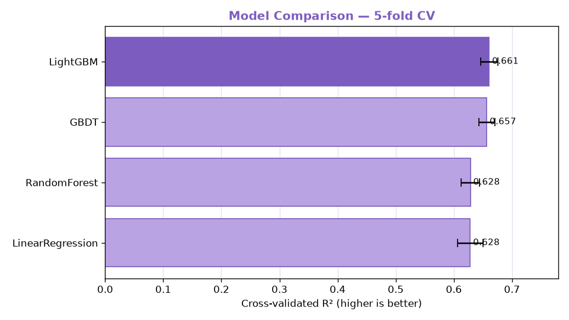
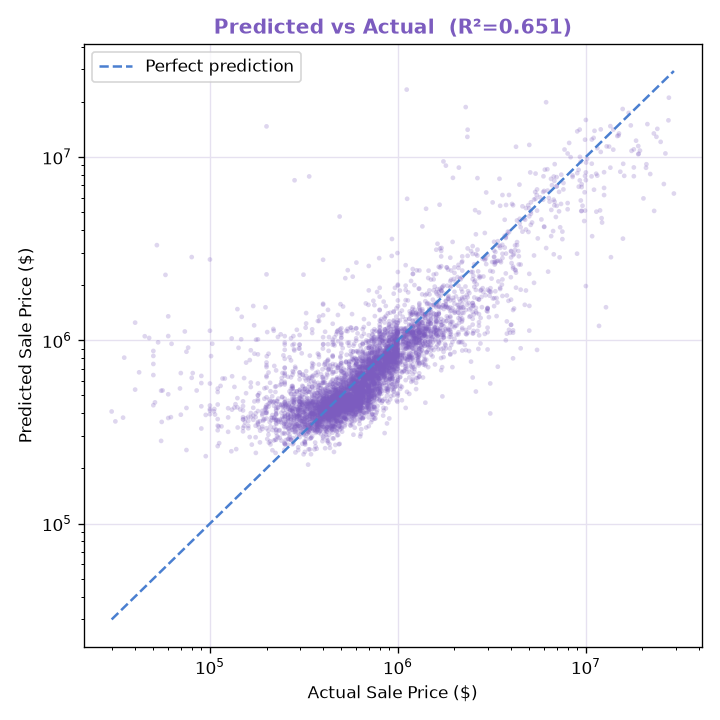
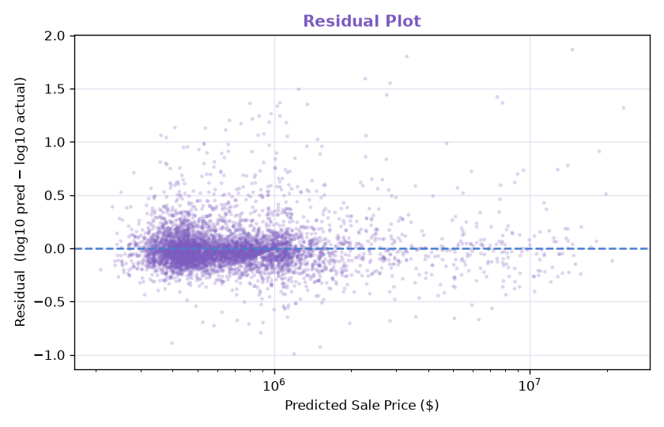
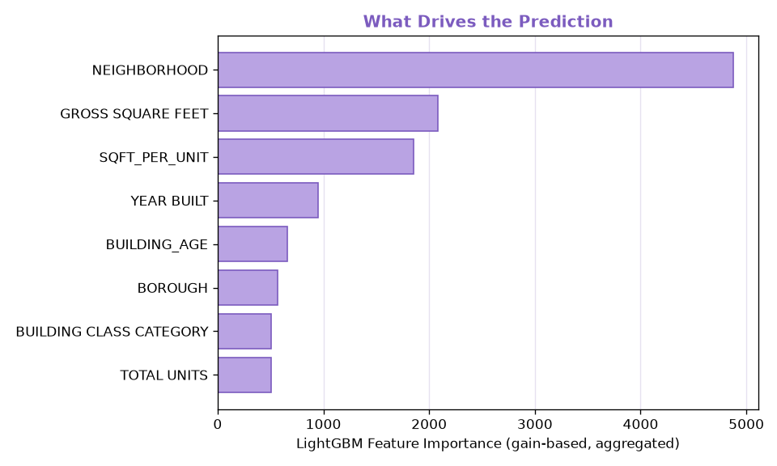

# NYC Real Estate Price Predictor

> Full-stack Flask application that analyzes NYC property sales and predicts prices using a **model-selection pipeline** — four candidate models are trained, cross-validated, and the best (a tuned **LightGBM** regressor) is served for prediction.

A bootcamp project demonstrating data cleaning, **model comparison & selection**, feature engineering, hyperparameter tuning, modular Python architecture, and Flask web development end-to-end.

---

## 📸 Screenshots

### Interactive Dashboard — 7 Plotly Charts


### Price Predictor (with borough → neighborhood cascading select)


---

## ✨ Features

- 📊 **7 interactive Plotly charts** analyzing 28K NYC property sales
- 🤖 **Model-selection pipeline** — Linear Regression, Random Forest, GBDT, and LightGBM are compared via 5-fold cross-validation; the champion is served
- 🏆 **Champion: tuned LightGBM**, **R² ≈ 0.68** on the held-out test set (up from KNN's 0.56)
- 🧬 **Feature engineering** — derived `SQFT_PER_UNIT`, `BUILDING_AGE` plus high-cardinality `NEIGHBORHOOD` (250 categories) and user-selected `BUILDING CLASS`
- 🎛️ **Hyperparameter tuning** via `GridSearchCV` with L2 regularization
- 🗺️ **Cascading dropdown** — pick a borough, then its neighborhoods (location is the #1 price driver)
- 🏗️ **Industrial Flask architecture** — Application Factory + Blueprint + Service Layer
- ✅ **Form validation** with friendly error messages
- 💾 **Model caching** via `joblib`

---

## 🚀 Quick Start

```bash
# 1. Clone
git clone https://github.com/chenxi-debugger/nyc-real-estate-analytics.git
cd nyc-real-estate-analytics

# 2. Set up virtual environment
python -m venv .venv
source .venv/bin/activate          # Windows: .venv\Scripts\activate

# 3. Install dependencies
pip install -r requirements.txt

# 4. Run the app — the trained model ships with the repo, so this works immediately
python -m app.run
```

Then open <http://127.0.0.1:5001/> in your browser.

**The app works out-of-the-box.** The trained champion model
(`models/champion_pipeline.pkl`) is committed with the project, so after
`git clone` you can run it straight away — no training step required.

`train_and_evaluate.py` is the **offline model-selection pipeline** — the
"work record" showing how the champion was chosen (4-model comparison,
GridSearch tuning, MLflow tracking, evaluation plots). You only run it if you
want to **reproduce or re-train** the model from scratch:

```bash
# Optional — only to reproduce the model-selection process
python train_and_evaluate.py        # retrains, re-tunes, regenerates plots + MLflow runs
mlflow ui                            # then browse http://127.0.0.1:5000 to see tracked experiments
```

---

## 🤖 The Model: Why Comparison, Not Guesswork

The first version of this project used a single **K-Nearest Neighbors** model — chosen early on simply because it was the most intuitive algorithm to start with. This rewrite replaces that guess with a principled **model-selection process**: train several candidates, score them fairly with cross-validation, and let the data pick the winner.

### Candidates — covering both ensemble families

| Model | Family | Role |
|---|---|---|
| Linear Regression | — | Baseline (performance floor) |
| Random Forest | **Bagging** | Many independent trees vote & average → reduces variance |
| GBDT | **Boosting** | Trees added sequentially, each correcting prior errors → reduces bias |
| **LightGBM** | **Boosting** | Industrial, regularized, efficient GBDT → **champion** |

### Model comparison (5-fold cross-validation)



| Model | CV R² |
|---|---|
| **LightGBM** | **0.675** |
| Random Forest | 0.659 |
| GBDT | 0.641 |
| Linear Regression | 0.223 |

The story the numbers tell: the linear baseline explains only ~22% of price variance (price is highly non-linear in these features), tree ensembles roughly triple that, and boosting edges out bagging — which is the typical outcome on tabular regression.

### Champion performance (tuned LightGBM, held-out test set)

| Metric | Value |
|---|---|
| R² | **≈ 0.68** |
| MAE | **≈ $350K** |
| RMSE | ≈ $1.16M |
| MAPE | ≈ 45% |

#### Predicted vs Actual



#### Residuals



### Why these design choices?

**1. `log10(SALE PRICE)` as the target.** NYC sale prices span 5 orders of magnitude. Training on `log10` compresses the long tail and makes the error metric meaningful across price ranges; predictions are exponentiated back to USD at inference.

**2. LightGBM's native handling of categories — no target encoding.** `NEIGHBORHOOD` has 250 categories. An early experiment with **target encoding** (replacing each neighborhood with its mean price) scored R² ≈ 0.656 but carries **data-leakage risk**. Letting the gradient-boosted trees split on one-hot categories directly was both *cleaner* (zero leakage) and *better* (R² ≈ 0.675). A case where the simpler, correct method beat the clever trick.

**3. Different preprocessing per model family.** Linear Regression gets `StandardScaler` on numeric features (it's sensitive to absolute magnitude); tree models get `passthrough` (they split on order, not scale, so scaling is a no-op). This is encoded as two separate `ColumnTransformer` configurations.

**4. Hyperparameter tuning with regularization.** `GridSearchCV` searches `n_estimators`, `learning_rate`, `num_leaves`, and `reg_lambda` (L2). Tuning is done on the training set only; the test set is never touched until the final report.

### Feature importance — location dominates



`NEIGHBORHOOD` is by far the strongest predictor — quantitatively confirming the real-estate truism that *location* drives price. The engineered `SQFT_PER_UNIT` ranks third, despite costing the user no extra input (it's derived server-side from area ÷ units).

### A note on KNN

KNN wasn't *wrong* — given the same `NEIGHBORHOOD` feature, it improves from R² 0.56 → 0.60. But the same feature lifts LightGBM by twice as much (→ 0.68). The reason: `NEIGHBORHOOD` is high-cardinality, and after one-hot encoding the feature space jumps to 255 dimensions. KNN measures distance in that space and suffers the **curse of dimensionality** (neighbors become unreliable), so it can only partly exploit location. Tree models split on categories directly, learn a price baseline per neighborhood, and are unaffected by dimensionality — so they use the single most important signal far more fully.

---

## 🧬 Features

| Feature | Source | Type |
|---|---|---|
| `GROSS SQUARE FEET` | user input | numeric |
| `YEAR BUILT` | user input | numeric |
| `TOTAL UNITS` | user input | numeric |
| `BOROUGH` | user input | categorical |
| `NEIGHBORHOOD` | user input (cascading) | categorical (250) |
| `SQFT_PER_UNIT` | **derived** (area ÷ units) | numeric |
| `BUILDING_AGE` | **derived** (sale year − built year) | numeric |
| `BUILDING CLASS CATEGORY` | user input (dropdown) | categorical (11 common types) |

The predict form asks the user for 6 inputs (5 fields + building class); SQFT_PER_UNIT and BUILDING_AGE are derived server-side. Every feature is meaningful at prediction time — an earlier SALE_MONTH feature was removed because it could only ever be a constant placeholder at inference (a training-serving skew), and building class was promoted from a default value to a real user-selected dropdown so the model actually uses it.

---

## 🗺️ Cascading Neighborhood Selection

`NEIGHBORHOOD` has 249 valid values — far too many for a single dropdown. The predict page uses a **two-level cascading select**: choose a borough (5 options), and JavaScript populates only that borough's 37–60 neighborhoods. The mapping is precomputed into `static/data/neighborhoods.json` at build time and injected into the page. On a failed submit, the form restores the user's borough *and* neighborhood selection.

---

## 🏗️ Architecture

This project follows the **Flask Application Factory Pattern** with **Blueprint** routing and a **Service Layer**.

```
nyc-real-estate-analytics/
├── app/
│   ├── run.py                  ← Application factory + entrypoint
│   ├── routes/
│   │   └── dashboard.py        ← Blueprint: / and /predict routes
│   ├── services/
│   │   ├── data_service.py     ← class DataService — load + clean CSV
│   │   └── model_service.py    ← class ModelService — 4-model compare/select/predict
│   └── utils/
│       ├── plot_helper.py      ← class PlotService — generates 7 chart JSONs
│       └── validators.py       ← Result Pattern form validation
├── train_and_evaluate.py       ← Offline: train, tune, generate eval plots
├── data/
│   └── nyc_real_estate.csv     ← 36K rows of NYC property sales (2016–2017)
├── models/
│   └── champion_pipeline.pkl   ← Trained champion model (committed — app works out-of-the-box)
├── static/
│   ├── data/neighborhoods.json ← Borough → neighborhood mapping
│   └── eval/                   ← Evaluation plots (PNG)
├── templates/
│   ├── index.html              ← Dashboard
│   └── predict.html            ← Prediction form (cascading select + JS)
└── docs/
```

### Why this structure?

| Concern | Solution |
|---|---|
| Avoid a monolithic `app.py` | Separate `services/`, `utils/`, `routes/` |
| Avoid circular imports | Routes use `current_app.config`, not direct imports |
| Make every module testable | Each file has an `if __name__ == "__main__"` self-test |
| Keep training off the request path | Offline `train_and_evaluate.py` produces the cached model |
| Avoid retraining on every restart | `joblib` cache to `models/` |

### The Service Layer pattern

The core logic is organized into three **service classes**, each owning one
responsibility:

| Service | Responsibility | Key state it holds | Public methods |
|---|---|---|---|
| `DataService` | Load & clean the CSV | `self.df` (cleaned DataFrame) | `load_data()` |
| `ModelService` | Compare, select & serve the model | `self.pipeline`, `self.leaderboard`, `self.metrics` | `fit_or_load()`, `predict()` |
| `PlotService` | Build the dashboard charts | chart JSON | `generate_all()` |

Each service bundles its **data (state)** together with the **methods that
operate on that data**, instead of scattering loose functions and global
variables across the project. A caller gets one object — e.g. `data_svc` —
and accesses both the cleaned table (`data_svc.df`) and the operations on it
(`data_svc.load_data()`) through the same handle.

**Why classes here and not just functions?** Because each service needs to
*hold state* across calls (the cleaned DataFrame is loaded once and reused by
the model and plot layers), bundle related operations together, and present a
consistent shape across the codebase. A one-shot "read a file, return a value"
task wouldn't need a class — these do.

> Note: this is a **Service Layer inside a single (monolithic) Flask app** — a
> code-organization pattern. It is *not* a microservice architecture, which
> would mean several independently deployed programs communicating over the
> network. Everything here runs in one process.

---

## 🧹 Data Cleaning

The raw CSV has **36,887 rows**; after cleaning, **28,162 rows** are used.

| Step | Logic |
|---|---|
| 1. Deduplication | `drop_duplicates()` |
| 2. Type coercion | `pd.to_numeric(errors='coerce')` on numeric columns |
| 3. Filter invalid values | `SALE PRICE > 10,000` · `GROSS SQUARE FEET > 0` · `1800 < YEAR BUILT ≤ 2030` · `1 ≤ TOTAL UNITS ≤ 1000` · `BOROUGH ∈ {1..5}` |
| 4. Outlier trimming (model only) | Top/bottom 0.5% of price & square footage dropped before training |
| 5. Derived columns | `BOROUGH_NAME` · `Price_Per_SqFt` · `SALE DATE` → datetime |

---

## ✅ Form Validation

The `/predict` route validates input through `app/utils/validators.py` using the **Result Pattern** `(cleaned, error)`:

| Field | Rule |
|---|---|
| `GROSS SQUARE FEET` | `> 0` |
| `YEAR BUILT` | `1800 ≤ y ≤ 2030` |
| `TOTAL UNITS` | `1 ≤ u ≤ 1000` |
| `BOROUGH` | `∈ {1, 2, 3, 4, 5}` |
| `NEIGHBORHOOD` | non-empty, must be valid for the chosen borough |

Invalid inputs return a friendly message and keep the user's entered values.

---

## 🧪 Self-Test Each Module

```bash
python -m app.services.data_service     # data loading + cleaning
python -m app.services.model_service     # train/compare 4 models, then predict
python -m app.utils.plot_helper          # chart generation
python -m app.utils.validators           # form validators
python train_and_evaluate.py             # full train + tune + plots
```

---

## 🛠️ Tech Stack

- **Backend**: Python 3.12, Flask 3.1
- **ML**: scikit-learn (Pipeline, ColumnTransformer, GridSearchCV), **LightGBM**
- **Data**: pandas, numpy
- **Viz**: Plotly (dashboard) + Matplotlib (evaluation plots)
- **Persistence**: joblib for model caching

---

## 📚 What I Learned

- **Don't pick a model — compare them.** The original KNN was an early guess. Building a 4-model cross-validated comparison turned "I used KNN" into "I evaluated bagging vs boosting and selected the best, with numbers to back it." That framing is the difference between *using* scikit-learn and *understanding* it.
- **Evaluation scale matters.** Comparing R² computed on `log10(price)` against R² on raw dollars is apples-to-oranges — a trap that made a strong model look weak until the metric was aligned.
- **The simple correct method can beat the clever one.** Native categorical splits beat target encoding here — both cleaner (no leakage) and higher R².
- **Feature engineering is high-leverage.** A derived `SQFT_PER_UNIT` became the 3rd most important feature at zero UX cost.
- **The curse of dimensionality is concrete, not abstract.** It's exactly why KNN under-uses the most important feature (`NEIGHBORHOOD`) while trees thrive on it.

---

## 🔮 Next Steps

- [ ] Add **comparable properties** display alongside predictions
- [ ] Expand the GridSearch and try **Optuna** for tuning
- [ ] Add **SHAP** values for per-prediction explanations
- [ ] Add **pytest** unit tests and GitHub Actions CI
- [ ] Deploy to **Render** (live demo link)
- [ ] Rewrite the frontend as a **React + TypeScript** SPA calling a JSON API

---

## 📄 License

For educational purposes (bootcamp coursework). Data is from publicly available NYC Department of Finance property sales records.
