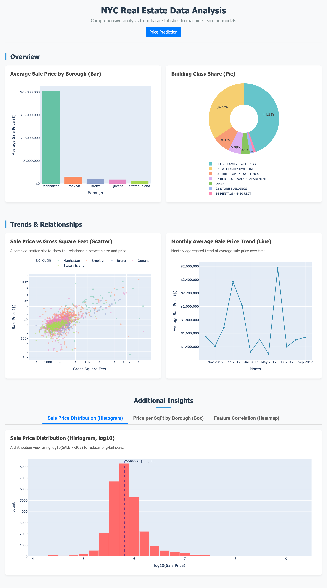
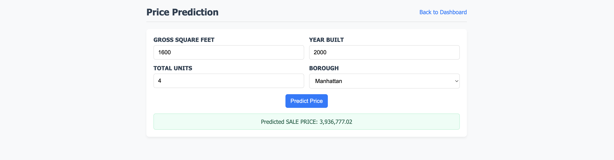

# NYC Real Estate KNN Predictor

> Full-stack Flask application that analyzes NYC property sales and predicts prices using a K-Nearest Neighbors regression model.

A bootcamp Phase 1 project demonstrating data cleaning, machine learning, modular Python architecture, and Flask web development end-to-end.

---

## 📸 Screenshots

### Interactive Dashboard — 7 Plotly Charts



### KNN Price Predictor



---

## ✨ Features

- 📊 **7 interactive Plotly charts** analyzing 28K NYC property sales
  - Bar, Pie (donut), Scatter (log-log), Line, Histogram, Box, Heatmap
- 🤖 **KNN regression model** predicting `SALE PRICE` with **R² = 0.536** on the test set
- 🏗️ **Industrial Flask architecture** — Application Factory + Blueprint + Service Layer
- ✅ **Form validation** with friendly error messages
- 💾 **Model caching** via `joblib` — first run trains, subsequent runs load in ms
- 🧪 **Self-testable modules** — every module has an `if __name__ == "__main__"` block

---

## 🚀 Quick Start

```bash
# 1. Clone
git clone https://github.com/chenxi-debugger/nyc-real-estate-knn.git
cd nyc-real-estate-knn

# 2. Set up virtual environment
python -m venv .venv
source .venv/bin/activate          # Windows: .venv\Scripts\activate

# 3. Install dependencies
pip install -r requirements.txt

# 4. Run the app
python -m app.run
```

Then open <http://127.0.0.1:5001/> in your browser.

**First run** trains the KNN model (~5 seconds) and caches it to `models/knn_pipeline.pkl`. **Subsequent runs** start in under a second.

---

## 🏗️ Architecture

This project follows the **Flask Application Factory Pattern** with **Blueprint** routing and a **Service Layer**.

nyc-real-estate-knn/
├── app/
│   ├── run.py                  ← Application factory + entrypoint
│   ├── routes/
│   │   └── dashboard.py        ← Blueprint: / and /predict routes
│   ├── services/
│   │   ├── data_service.py     ← class DataService — load + clean CSV
│   │   └── model_service.py    ← class ModelService — KNN train/cache/predict
│   └── utils/
│       ├── plot_helper.py      ← class PlotService — generates 7 chart JSONs
│       └── validators.py       ← Result Pattern form validation
├── data/
│   └── nyc_real_estate.csv     ← 36K rows of NYC property sales (2016–2017)
├── models/
│   └── knn_pipeline.pkl        ← Cached trained model (gitignored)
├── templates/
│   ├── index.html              ← Dashboard
│   └── predict.html            ← Prediction form
├── notebooks/                  ← Exploratory analysis
└── docs/
└── reference_images/       ← Project requirements references


### Why this structure?

| Concern | Solution |
|---|---|
| Avoid 250-line monolithic `app.py` | Separate `services/`, `utils/`, `routes/` |
| Avoid circular imports between routes and app | Routes use `current_app.config`, not direct imports |
| Make every module independently testable | Each file has `if __name__ == "__main__"` self-test |
| Avoid retraining model on every restart | `joblib.dump`/`load` cache to `models/` |

---

## 🤖 The Model

ColumnTransformer
├── StandardScaler  on  [GROSS SQUARE FEET, YEAR BUILT, TOTAL UNITS]
└── OneHotEncoder   on  [BOROUGH]
│
▼
KNeighborsRegressor(n_neighbors=10, weights="distance")
│
▼
Target: log10(SALE PRICE)   →   exp back to USD at inference

### Model performance (test set, 5,539 samples)

| Metric | Value |
|---|---|
| R² | **0.536** |
| MAE | **$483,066** |
| n_train | 22,153 |
| n_test | 5,539 |

### Why these design choices?

**1. `log10(SALE PRICE)` as target.** NYC sale prices span 5 orders of magnitude ($10K → $2.2B). KNN predicts via *mean of neighbors*, which is hijacked by a single outlier neighbor on long-tail targets. Training on `log10` compresses the long tail into additive distance; predictions exponentiate back to USD. This alone improved R² from **~0.30 → 0.536**.

**2. Outlier trimming before training.** Top/bottom 0.5% of prices and square footage are dropped from the training set. A few $100M+ Manhattan transactions otherwise dominate the neighbor distance structure.

**3. `weights="distance"`.** Closer neighbors get higher weight than farther ones, which improves robustness when the 10 neighbors are uneven in similarity.

**4. `ColumnTransformer` inside the Pipeline.** The same preprocessing (scaling numerics, one-hot encoding `BOROUGH`) is applied identically at train and inference time. No risk of column-order mismatch or drift between training and serving.

---

## 🧹 Data Cleaning

The raw CSV has **36,887 rows**; after cleaning, **28,162 rows** are used.

| Step | Logic |
|---|---|
| 1. Deduplication | `drop_duplicates()` |
| 2. Type coercion | `pd.to_numeric(errors='coerce')` on 5 numeric columns |
| 3. Filter invalid values | `SALE PRICE > 10,000` (drop $1 nominal transfers)  ·  `GROSS SQUARE FEET > 0`  ·  `1800 < YEAR BUILT ≤ 2030`  ·  `1 ≤ TOTAL UNITS ≤ 1000`  ·  `BOROUGH ∈ {1, 2, 3, 4, 5}` |
| 4. Derived columns | `BOROUGH_NAME` (Manhattan / Bronx / Brooklyn / Queens / Staten Island)  ·  `Price_Per_SqFt`  ·  `SALE DATE` parsed to datetime |

---

## 📊 The 7 Charts

All charts use **Plotly Express** (`px.*`) for concise modern syntax. Each chart type appears exactly once (per project requirements).

| # | Type | Chart | Data volume control |
|---|---|---|---|
| 1 | Bar | Average Sale Price by Borough | Aggregated to 5 bars |
| 2 | Pie | Building Class Share (Top 6 + Other) | Aggregated to 7 slices |
| 3 | Scatter | Sale Price vs Gross SqFt | Sampled to 2,000 points + log-log axes |
| 4 | Line | Monthly Avg Sale Price Trend | Aggregated to 12 monthly points |
| 5 | Histogram | Sale Price Distribution (log10) | 50 bins + median annotation |
| 6 | Box | Price/SqFt by Borough | Aggregated to 5 box plots |
| 7 | Heatmap | Feature Correlation | 5×5 matrix |

---

## ✅ Form Validation

The `/predict` route validates input through `app/utils/validators.py` using the **Result Pattern**:

```python
cleaned, error = validate_prediction_form(request.form)
if error:
    # render template with error message
else:
    result = model_svc.predict(**cleaned)
```

| Field | Rule |
|---|---|
| `GROSS SQUARE FEET` | `> 0` |
| `YEAR BUILT` | `1800 ≤ y ≤ 2030` |
| `TOTAL UNITS` | `1 ≤ u ≤ 1000` |
| `BOROUGH` | `∈ {1, 2, 3, 4, 5}` |

All invalid inputs return a friendly error message and the form keeps the user's entered values for editing.

---

## 🧪 Self-Test Each Module

Every module is independently runnable:

```bash
# Test data loading + cleaning
python -m app.services.data_service

# Test KNN model (trains if no cache, else loads)
python -m app.services.model_service

# Test chart generation
python -m app.utils.plot_helper

# Test form validators (12 test cases)
python -m app.utils.validators
```

---

## 🛠️ Tech Stack

- **Backend**: Python 3.12, Flask 3.1
- **ML**: scikit-learn 1.8 (KNN + Pipeline + ColumnTransformer)
- **Data**: pandas 3.0, numpy 2.4
- **Viz**: Plotly 6.7 (Plotly Express)
- **Persistence**: joblib for model caching

---

## 📚 What I Learned

- **Long-tail targets need log transforms** — discovered when my initial KNN gave R² = 0.30; switching to `log10` jumped it to 0.54. This is now my default for any price/revenue regression target.
- **`ColumnTransformer` inside Pipeline beats manual one-hot every time** — eliminates train/inference column mismatch bugs.
- **Flask Application Factory Pattern + Blueprint is worth the upfront complexity** — even for a 2-route app, the separation made each module independently testable and the codebase trivial to navigate.
- **Result Pattern beats exceptions for input validation** — making `(cleaned, error)` the return type forces callers to handle both paths explicitly.
- **Every module deserves `if __name__ == "__main__"` self-tests** — they doubled as my regression checks during refactoring.

---

## 🔮 Next Steps

- [ ] Add **comparable properties** display alongside predictions (KNN's natural explainability win)
- [ ] Add **GridSearchCV** for `n_neighbors` and `weights` tuning
- [ ] Compare KNN against **Linear Regression**, **Ridge**, and **RandomForest** baselines
- [ ] Add **pytest** unit tests and GitHub Actions CI
- [ ] Deploy to **Render** (live demo link)
- [ ] Rewrite the frontend as a **React + TypeScript** SPA calling a JSON API

---

## 📄 License

This project is for educational purposes (bootcamp coursework). Data is from publicly available NYC Department of Finance property sales records.